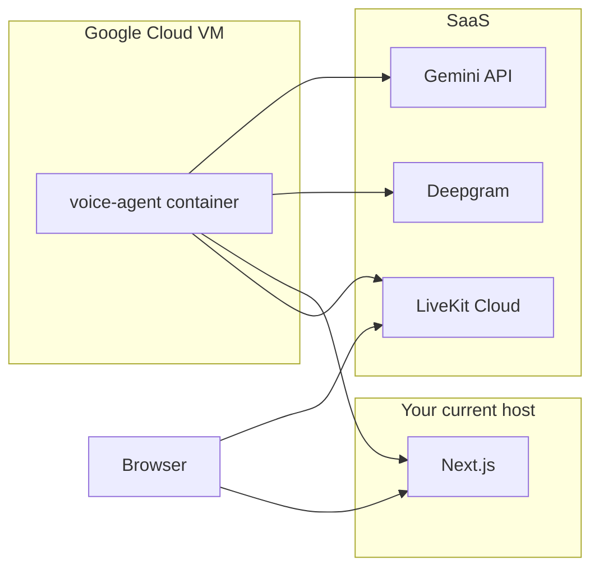

# Self-Service Guide: Host Vidhyapika Voice Agent on GCP

You will do everything yourself from **PowerShell or CMD** using your own Google account (`gcloud auth login`). No service account JSON needs to be shared with anyone.

---

## What you are deploying

| Component | Where it runs |
|-----------|---------------|
| Next.js app | Your existing host (Vercel, etc.) — **unchanged** |
| `voice-agent/` worker | **GCP Compute Engine VM** (Docker) |
| LiveKit / Deepgram / Gemini | External SaaS (API keys only) |

The worker is a **long-running process** (not a public HTTP API). It connects **outbound** to LiveKit Cloud and your Next.js URL. No inbound firewall rules are required.



**Important:** The production container runs only the LiveKit agent (`voice-agent/src/start-all.ts`). It does **not** run the local Socket.IO bridge. Whiteboard updates go over **LiveKit data channels** to the browser.

---

## Before you start — checklist

### On your PC

- [ ] [Google Cloud SDK (`gcloud`)](https://cloud.google.com/sdk/docs/install) installed
- [ ] [Docker Desktop](https://www.docker.com/products/docker-desktop/) installed (optional; Cloud Build can build remotely without local Docker)
- [ ] Billing enabled on a GCP project
- [ ] This repo cloned locally

### Credentials you need (keep private — never commit to git)

| Variable | Used by |
|----------|---------|
| `LIVEKIT_URL` | Next.js + worker |
| `LIVEKIT_API_KEY` | Next.js + worker |
| `LIVEKIT_API_SECRET` | Next.js + worker |
| `LIVEKIT_AGENT_NAME` | Must be `vidhyapika-tutor` on **both** sides |
| `DEEPGRAM_API_KEY` | Worker (STT + TTS) |
| `GEMINI_API_KEY` | Next.js (bootstrap) + worker (LLM) |
| `VOICE_AGENT_SERVICE_SECRET` | Same 16+ char secret on **both** sides |
| `NEXT_APP_URL` | Worker only — your **production** Next.js HTTPS URL |
| `HF_TOKEN` | Optional (image scene tool) |

### On your Next.js production host (Vercel, etc.)

Set these **before** testing GCP worker:

```
LIVEKIT_URL=...
LIVEKIT_API_KEY=...
LIVEKIT_API_SECRET=...
LIVEKIT_AGENT_NAME=vidhyapika-tutor
VOICE_AGENT_SERVICE_SECRET=...    # same value as on GCP VM
GEMINI_API_KEY=...
APP_URL=https://your-production-domain.com
```

### Avoid duplicate tutors

- **Stop** local `voice-agent` (`npm run dev` in `voice-agent/`) once the GCP worker is live.
- Do **not** run two workers with the same `LIVEKIT_AGENT_NAME` (local + GCP, or GCP + LiveKit Cloud agent deploy).

---

## Step 0a — Enable billing (required first)

If you see `Billing account for project ... is not found` or `UREQ_PROJECT_BILLING_NOT_FOUND`, APIs cannot be enabled until billing is linked.

1. Open [Google Cloud Console → Billing](https://console.cloud.google.com/billing).
2. Create or select a **billing account** (card required; new accounts often get free trial credit).
3. Open [Manage billing for your project](https://console.cloud.google.com/billing/linkedaccount) and **link** that billing account to your project.

Verify billing is linked (replace `YOUR_PROJECT_ID` with your project **ID**, not the numeric project number):

```powershell
gcloud billing projects describe YOUR_PROJECT_ID
```

You should see `billingEnabled: true`. If not, wait a minute and retry Step 1.

---

## Step 0b — Log in to GCP (your account, not a shared key)

Open PowerShell in your repo folder:

```powershell
gcloud auth login
gcloud auth application-default login
```

Find your **project ID** (string like `vidhyapika-prod`, not the number `155207791905`):

```powershell
gcloud projects list
```

Set project and region:

```powershell
gcloud config set project YOUR_PROJECT_ID
gcloud config set compute/region asia-south1
gcloud config set compute/zone asia-south1-a
```

Replace `YOUR_PROJECT_ID` and region/zone as needed (`us-central1` / `us-central1-a` for US).

Verify:

```powershell
gcloud config list
gcloud projects describe YOUR_PROJECT_ID
```

---

## Step 1 — Enable required APIs

```powershell
gcloud services enable `
  artifactregistry.googleapis.com `
  cloudbuild.googleapis.com `
  compute.googleapis.com `
  secretmanager.googleapis.com
```

Wait ~1–2 minutes for APIs to propagate.

---

## Step 2 — Create Artifact Registry (Docker image storage)

```powershell
gcloud artifacts repositories create vidhyapika `
  --repository-format=docker `
  --location=asia-south1 `
  --description="Vidhyapika voice-agent images"
```

Grant Cloud Build permission to push images:

```powershell
$PROJECT_NUMBER = gcloud projects describe YOUR_PROJECT_ID --format="value(projectNumber)"

gcloud artifacts repositories add-iam-policy-binding vidhyapika `
  --location=asia-south1 `
  --member="serviceAccount:${PROJECT_NUMBER}@cloudbuild.gserviceaccount.com" `
  --role="roles/artifactregistry.writer"
```

---

## Step 3 — Store secrets in Secret Manager (recommended)

Create each secret once. Run from PowerShell; you will be prompted to type the value (or pipe from a file).

```powershell
# Example — repeat for each secret name
"YOUR_LIVEKIT_URL" | gcloud secrets create LIVEKIT_URL --data-file=-
```

Create all of these:

| Secret name | Example value |
|-------------|---------------|
| `LIVEKIT_URL` | `wss://your-project.livekit.cloud` |
| `LIVEKIT_API_KEY` | LiveKit key |
| `LIVEKIT_API_SECRET` | LiveKit secret |
| `DEEPGRAM_API_KEY` | Deepgram key |
| `GEMINI_API_KEY` | Gemini key |
| `VOICE_AGENT_SERVICE_SECRET` | Same as Next.js production |
| `NEXT_APP_URL` | `https://your-production-domain.com` |

`LIVEKIT_AGENT_NAME` is not a secret — hardcode `vidhyapika-tutor` in the env file on the VM.

**Alternative (simpler for first deploy):** Skip Secret Manager and put all values in a file on the VM only (Step 7). Less secure but faster to test.

---

## Step 4 — Cloud Build config (already in repo)

This repo includes `voice-agent/cloudbuild.yaml`. It builds from the `voice-agent/` subdirectory so the Dockerfile context is correct.

If you change regions, update `asia-south1` in that file to match your Artifact Registry location.

---

## Step 5 — Build and push the Docker image

From the **repo root**:

```powershell
gcloud builds submit . --config=voice-agent/cloudbuild.yaml
```

This runs remotely on Cloud Build (no local Docker required). First build may take 5–10 minutes.

When done, note the image URL:

```
asia-south1-docker.pkg.dev/YOUR_PROJECT_ID/vidhyapika/voice-agent:latest
```

---

## Step 6 — Create the Compute Engine VM

```powershell
gcloud compute instances create vidhyapika-voice-agent `
  --zone=asia-south1-a `
  --machine-type=e2-medium `
  --image-family=cos-stable `
  --image-project=cos-cloud `
  --scopes=cloud-platform `
  --tags=voice-agent
```

- **e2-medium** (2 vCPU, 4 GB RAM): good starting point for Silero VAD + Gemini + Deepgram
- **Container-Optimized OS (COS):** Docker pre-installed
- **No inbound firewall rules** needed — worker only makes outbound connections

If using Secret Manager on the VM, grant the VM's service account access:

```powershell
$PROJECT_NUMBER = gcloud projects describe YOUR_PROJECT_ID --format="value(projectNumber)"

gcloud projects add-iam-policy-binding YOUR_PROJECT_ID `
  --member="serviceAccount:${PROJECT_NUMBER}-compute@developer.gserviceaccount.com" `
  --role="roles/secretmanager.secretAccessor"
```

---

## Step 7 — SSH into the VM and run the container

```powershell
gcloud compute ssh vidhyapika-voice-agent --zone=asia-south1-a
```

On the VM:

### 7a — Configure Docker for Artifact Registry

```bash
gcloud auth configure-docker asia-south1-docker.pkg.dev
```

### 7b — Create env file (manual method)

```bash
sudo mkdir -p /etc/vidhyapika
sudo nano /etc/vidhyapika/voice-agent.env
```

Paste (replace with your real values):

```env
LIVEKIT_URL=wss://your-project.livekit.cloud
LIVEKIT_API_KEY=your-key
LIVEKIT_API_SECRET=your-secret
LIVEKIT_AGENT_NAME=vidhyapika-tutor
DEEPGRAM_API_KEY=your-deepgram-key
GEMINI_API_KEY=your-gemini-key
VOICE_AGENT_SERVICE_SECRET=your-shared-secret-min-16-chars
NEXT_APP_URL=https://your-production-domain.com
NODE_ENV=production
```

Save and restrict permissions:

```bash
sudo chmod 600 /etc/vidhyapika/voice-agent.env
```

### 7c — Pull and run

```bash
docker pull asia-south1-docker.pkg.dev/YOUR_PROJECT_ID/vidhyapika/voice-agent:latest

docker run -d \
  --name voice-agent \
  --restart unless-stopped \
  --env-file /etc/vidhyapika/voice-agent.env \
  asia-south1-docker.pkg.dev/YOUR_PROJECT_ID/vidhyapika/voice-agent:latest
```

### 7d — Check logs

```bash
docker logs -f voice-agent
```

Healthy signs:

- No `LIVEKIT_URL` / auth errors
- Worker registers with agent name `vidhyapika-tutor`
- After you start Admin Voice Lab: `[voice-agent] job received { room: 'tutor-...' }`

Exit logs with `Ctrl+C` (container keeps running).

---

## Step 8 — (Optional) Survive VM reboot with systemd

On the VM, create a systemd unit so Docker restarts after reboot:

```bash
sudo nano /etc/systemd/system/vidhyapika-voice-agent.service
```

```ini
[Unit]
Description=Vidhyapika Voice Agent
After=docker.service
Requires=docker.service

[Service]
Restart=always
RestartSec=10
ExecStartPre=-/usr/bin/docker stop voice-agent
ExecStartPre=-/usr/bin/docker rm voice-agent
ExecStartPre=/usr/bin/docker pull asia-south1-docker.pkg.dev/YOUR_PROJECT_ID/vidhyapika/voice-agent:latest
ExecStart=/usr/bin/docker run --rm --name voice-agent --env-file /etc/vidhyapika/voice-agent.env asia-south1-docker.pkg.dev/YOUR_PROJECT_ID/vidhyapika/voice-agent:latest
ExecStop=/usr/bin/docker stop voice-agent

[Install]
WantedBy=multi-user.target
```

Enable:

```bash
sudo systemctl daemon-reload
sudo systemctl enable vidhyapika-voice-agent
sudo systemctl start vidhyapika-voice-agent
sudo systemctl status vidhyapika-voice-agent
```

---

## Step 9 — Verify end-to-end

### 9a — Worker logs

```bash
docker logs voice-agent 2>&1 | tail -50
```

### 9b — Next.js internal API (from VM or your PC)

```powershell
curl -H "x-voice-agent-secret: YOUR_SECRET" `
  "https://your-production-domain.com/api/voice/internal/session-meta?roomName=fake-room"
```

- **401** = secret mismatch between GCP env and Next.js production
- **404** = auth OK (fake room not found — expected)

### 9c — Admin Voice Lab

1. Open `https://your-production-domain.com/admin/voice-lab`
2. Start a **new** sandbox session
3. Confirm:
   - One tutor/agent in the room (not two)
   - Greeting mentions your configured topic
   - Speaking after greeting gets an on-topic reply

### 9d — Stop local dev agent

On your Windows machine, stop `npm run dev` in `voice-agent/` so only the GCP worker answers dispatches.

---

## Step 10 — Deploy updates after code changes

When you change files under `voice-agent/`:

```powershell
# 1. Build + push (from repo root)
gcloud builds submit . --config=voice-agent/cloudbuild.yaml

# 2. SSH to VM and restart
gcloud compute ssh vidhyapika-voice-agent --zone=asia-south1-a
```

On VM:

```bash
sudo docker stop voice-agent && sudo docker rm voice-agent

sudo DOCKER_CONFIG=/mnt/stateful_partition/docker-config \
  docker pull asia-south1-docker.pkg.dev/YOUR_PROJECT_ID/vidhyapika/voice-agent:latest

sudo docker run -d --name voice-agent --restart unless-stopped \
  --env-file /etc/vidhyapika/voice-agent.env \
  asia-south1-docker.pkg.dev/YOUR_PROJECT_ID/vidhyapika/voice-agent:latest
```

Or, if using systemd: `sudo systemctl restart vidhyapika-voice-agent`

---

## Troubleshooting

| Symptom | Likely cause | Fix |
|---------|--------------|-----|
| `failed to retrieve region info` / `settings/regions` in agent logs | Docker image missing SSL CA certs (`node:*-slim`) | Add `ca-certificates` to [`voice-agent/Dockerfile`](../voice-agent/Dockerfile), rebuild image, restart container |
| Stuck on "Connecting to voice…" | Worker not running or wrong LiveKit creds | Check `docker logs voice-agent` |
| Two tutors speaking | Local + GCP both running same agent name | Stop local `voice-agent` |
| Agent never joins | `LIVEKIT_AGENT_NAME` mismatch | Must be `vidhyapika-tutor` on Next.js and worker |
| `session-meta HTTP 401` | Secret mismatch | Align `VOICE_AGENT_SERVICE_SECRET` on both hosts |
| Generic greeting / wrong subject | Empty room in agent logs | Ensure latest Next.js + single dispatch deploy is live |
| No audio / STT | Missing Deepgram key on worker | Add `DEEPGRAM_API_KEY` to VM env file |
| `session-meta fetch failed` | Wrong `NEXT_APP_URL` or Next.js down | Use production HTTPS URL, test curl |
| Cloud Build fails | Wrong region in image path | Match `asia-south1` in `cloudbuild.yaml` and Artifact Registry |

---

## Cost estimate (rough)

| Resource | Approx. monthly |
|----------|-----------------|
| e2-medium VM (always on) | $25–35 |
| Artifact Registry | ~$1 |
| Cloud Build | Usually within free tier |
| LiveKit + Deepgram + Gemini | Usage-based (separate billing) |

---

## Security notes

- Never commit `.env`, `voice-agent.env`, or service account JSON to git
- Prefer Secret Manager over plain env files for production
- Rotate `VOICE_AGENT_SERVICE_SECRET` if it was ever exposed
- VM needs **no** public inbound ports — only outbound HTTPS/WSS

---

## Quick reference — full command sequence (copy-paste)

Run from PowerShell. Replace `YOUR_PROJECT_ID` everywhere with your project **ID** from `gcloud projects list`.

### A — One-time: billing (browser)

Link billing at https://console.cloud.google.com/billing/linkedaccount then verify:

```powershell
gcloud billing projects describe YOUR_PROJECT_ID
```

### B — Auth and project (Windows)

```powershell
gcloud auth login
gcloud auth application-default login
gcloud projects list
gcloud config set project YOUR_PROJECT_ID
gcloud config set compute/region asia-south1
gcloud config set compute/zone asia-south1-a
```

### C — Enable APIs

```powershell
gcloud services enable artifactregistry.googleapis.com cloudbuild.googleapis.com compute.googleapis.com secretmanager.googleapis.com
```

### D — Artifact Registry + Cloud Build push access

```powershell
gcloud artifacts repositories create vidhyapika --repository-format=docker --location=asia-south1 --description="Vidhyapika voice-agent images"

$PROJECT_NUMBER = gcloud projects describe YOUR_PROJECT_ID --format="value(projectNumber)"

gcloud artifacts repositories add-iam-policy-binding vidhyapika --location=asia-south1 --member="serviceAccount:${PROJECT_NUMBER}@cloudbuild.gserviceaccount.com" --role="roles/artifactregistry.writer"
```

If the repository already exists, skip the `create` line and run only the IAM binding.

### E — Build and push image (from repo root)

```powershell
cd D:\Holoncode\vidhyapika
gcloud builds submit . --config=voice-agent/cloudbuild.yaml
```

### F — Create VM

```powershell
gcloud compute instances create vidhyapika-voice-agent --zone=asia-south1-a --machine-type=e2-medium --image-family=cos-stable --image-project=cos-cloud --scopes=cloud-platform --tags=voice-agent
```

### G — SSH into VM

```powershell
gcloud compute ssh vidhyapika-voice-agent --zone=asia-south1-a
```

### H — On the VM (Linux bash)

```bash
gcloud auth configure-docker asia-south1-docker.pkg.dev

sudo mkdir -p /etc/vidhyapika
sudo nano /etc/vidhyapika/voice-agent.env
# paste env vars (LIVEKIT_*, DEEPGRAM, GEMINI, VOICE_AGENT_SERVICE_SECRET, NEXT_APP_URL, LIVEKIT_AGENT_NAME=vidhyapika-tutor)
sudo chmod 600 /etc/vidhyapika/voice-agent.env

docker pull asia-south1-docker.pkg.dev/YOUR_PROJECT_ID/vidhyapika/voice-agent:latest

docker run -d --name voice-agent --restart unless-stopped --env-file /etc/vidhyapika/voice-agent.env asia-south1-docker.pkg.dev/YOUR_PROJECT_ID/vidhyapika/voice-agent:latest

docker logs -f voice-agent
```

### I — Verify from your PC

```powershell
curl -H "x-voice-agent-secret: YOUR_SECRET" "https://your-production-domain.com/api/voice/internal/session-meta?roomName=fake-room"
```

Then test Admin Voice Lab on production. Stop local `voice-agent` (`npm run dev`) so only GCP answers dispatches.

No credentials need to be shared with anyone else — run these steps on your own machine with `gcloud auth login`.
