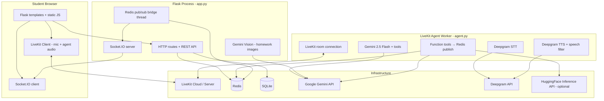

# AI Tutor Platform — Technical Specification (Porting Guide)

This document describes the **entire AI Tutor platform** so another engineering team (or coding agent) can rebuild the same product on a **different tech stack** while preserving behavior, pedagogy, and integration contracts.

**Current reference implementation:** Python 3.x, Flask, LiveKit Agents, Gemini, Deepgram, Redis, SQLite, vanilla JavaScript.

---

## 1. Product summary

### 1.1 What it is

A **live voice tutoring application** where:

1. A student picks a **topic** and **grade/standard** on a web landing page.
2. They enter a **classroom** with:
   - **Real-time voice** conversation with an AI tutor (WebRTC via LiveKit).
   - A **linear whiteboard** (scrollable artifact cards: text, math, code, diagrams, scenes).
   - A **knowledge graph** (concept map that grows during the lesson).
   - **Cognitive state** badge (FLOW / CONFUSED / BORED / LOST).
   - Optional **homework image upload** analyzed by vision LLM; feedback is spoken by the agent.
3. At session end, the agent produces **notes** and a **5-item assignment**; these are stored and shown in history.

### 1.2 Design principles (non-negotiable for parity)

| Principle | Meaning |
|-----------|---------|
| **Tools are truth** | If the tutor says something is on the board, a tool must have been called in that turn. Speech never substitutes for board content. |
| **Speech ≠ board** | Spoken output is **plain English**. Math notation, markdown, and `$...$` belong on the board/HTML only. TTS must verbalize math ("x squared", not "dollar x caret 2"). |
| **One content slot per turn** | Per assistant message: at most **one** primary linear-board tool among title/highlight/write/step/code/rich_card/show_diagram/show_scene (exceptions: `show_question`, graph tools, cognitive state). |
| **Artifact-first board** | Primary teaching surface is **HTML artifact cards** (`show_rich_card`), not raw chalk text. |
| **Dual visual generators** | **Diagrams** = Gemini → HTML/SVG. **Scenes** = HuggingFace FLUX → PNG data URI. Never swap these backends. |
| **Graph + board are separate** | Knowledge graph persists; `clear_whiteboard` does not clear the graph. |

---

## 2. High-level architecture



### 2.1 Why two server processes?

| Process | Role |
|---------|------|
| **`app.py`** | Web UI, session CRUD, LiveKit **student** tokens, Socket.IO to browser, Redis→browser bridge, image vision API. |
| **`agent.py dev`** | LiveKit **agent worker**; joins room when student connects; runs voice pipeline and tools. |

They communicate only via **Redis** and **LiveKit** (not HTTP between each other).

---

## 3. Session lifecycle

### 3.1 Create session

1. **POST** `/api/session/create` with `{ "topic": "...", "standard": "Grade 7" }`.
2. Flask:
   - Inserts row in `sessions` (`room_name` = `tutor-{uuid}`).
   - **HSET** `meta:{room_name}` → `{ topic, standard }` (TTL 24h).
   - Returns `{ session_id, room_name, token, livekit_url }`.
3. Browser stores `livekit_url` + `token` in `sessionStorage`, redirects to `/classroom/{session_id}`.

### 3.2 Join classroom

1. Browser **Socket.IO** `join_session` with `session_id` (Flask room = session UUID).
2. Browser **LiveKit** `connect(livekit_url, token)` as identity `student`.
3. LiveKit dispatches job to agent worker → `entrypoint(ctx)`:
   - `ctx.connect()` to same `room_name`.
   - Read `meta:{room_name}` from Redis.
   - Start `AgentSession` (STT + LLM + TTS).
   - Greeting via `session.say(...)`.
4. Agent listens to Redis channel `agent_context:{room_name}` for image analysis / force end.

### 3.3 During lesson

- **Student speech:** mic → LiveKit → agent STT → LLM → tools + TTS → student hears agent.
- **Board/graph:** agent tool → Redis `whiteboard:{room_name}` → Flask bridge → Socket.IO `whiteboard_event` → JS handlers.
- **Transcript:** agent speech committed → Redis `transcript:{room_name}` → Socket.IO `transcript`.
- **Homework image:** POST analyze → Gemini Vision → Redis `agent_context` → agent speaks analysis.

### 3.4 End session

- Agent calls `end_session(notes, assignment)` **or** user clicks End → POST force_end → Redis → agent generates notes if needed.
- Redis `session_event:{room_name}` `{ type: "end", notes, assignment }` → Flask saves to SQLite, emits `session_ended` to browser.

---

## 4. Redis channel contract

All channels use pattern: `{prefix}:{room_name}` where `room_name` = `tutor-{session_uuid}`.

| Prefix (config key) | Direction | Purpose |
|---------------------|-----------|---------|
| `meta` (`REDIS_META_PREFIX`) | Flask → Agent | Session topic & standard (hash). |
| `whiteboard` (`REDIS_WHITEBOARD_PREFIX`) | Agent → Flask | Board + graph + cognitive UI events (JSON). |
| `transcript` (`REDIS_TRANSCRIPT_PREFIX`) | Agent → Flask | Tutor spoken text for UI transcript strip. |
| `session_event` (`REDIS_SESSION_PREFIX`) | Agent → Flask | Session end payload. |
| `agent_context` (`REDIS_AGENT_CTX_PREFIX`) | Flask → Agent | Image analysis text, force end. |

**Flask bridge** (`app.py` `_redis_bridge`): subscribes to `whiteboard:*`, `session_event:*`, `transcript:*`; maps `room_name` → `session_id` via SQLite; emits Socket.IO to room `session_id`.

**Agent** (`TutorAgent._wb`): `PUBLISH whiteboard:{room_name} json.dumps(payload)`.

---

## 5. Voice agent pipeline (porting critical)

### 5.1 Stack mapping

| Concern | Current implementation | Port using |
|---------|------------------------|------------|
| Real-time transport | LiveKit WebRTC | Any WebRTC SFU (LiveKit, Daily, custom) |
| Agent framework | `livekit-agents` v1.x | Your worker + room join API |
| STT | Deepgram | Whisper, Azure Speech, Deepgram, etc. |
| LLM | Gemini 2.5 Flash | Any tool-calling chat model |
| TTS | Deepgram Aura (`aura-asteria-en`) | Any neural TTS |
| VAD | Silero via plugin | WebRTC VAD or equivalent |
| Tool execution | `@function_tool` on `TutorAgent` | Native function calling |

### 5.2 AgentSession configuration

```python
AgentSession(
    stt=deepgram.STT(api_key=...),
    llm=google.LLM(
        model="gemini-2.5-flash",
        temperature=0.52,
        max_output_tokens=8192,
        thinking_config={"thinking_budget": 0},  # reduce "thinking" text leaking to TTS
    ),
    tts=deepgram.TTS(model="aura-asteria-en", ...),
    vad=silero.VAD.load(),  # prewarmed in idle worker
    max_tool_steps=40,      # tutor chains many tools per turn
)
```

### 5.3 Entrypoint sequence (must preserve timing)

1. `ctx.connect()` within ~10s of job start (LiveKit watchdog).
2. Load topic/standard from Redis (timeout ~4s; defaults if missing).
3. `session.start(room, agent)` immediately after connect.
4. `session.say(greeting)`.
5. Background task: subscribe `agent_context:{room}` for image/force_end.
6. `wait_for_disconnect()` until room ends.

**Worker prewarm:** load Silero VAD once per idle process; `num_idle_processes=1` in dev.

### 5.4 Gemini plugin patch (thought → TTS leak)

Gemini 2.5 may emit `part.thought=True` or `tool_code` text. The reference patches `LLMStream._parse_part` to:

1. Always forward `function_call` / `function_response` first.
2. Drop `thought` parts (do not send to TTS).
3. Drop `executable_code` parts.

**Port:** equivalent filter on LLM stream before TTS.

### 5.5 TTS text pipeline (`_prepare_spoken_text`)

Applied to **every** string sent to TTS and transcript:

```
raw LLM text
  → _strip_gemini_thinking()     # tool_code blocks, thought sections, print() rehearsal
  → _strip_markdown_for_speech() # **, ##, `, bullets
  → _verbalize_math_for_speech() # $...$, $$...$$, ^2, \frac, etc.
```

**`tts_node`:** streams sentence-by-sentence (`. ` `; ` paragraph breaks); does **not** buffer entire reply (deadlocks tool calls).

**KaTeX on board:** when enhancing artifact HTML, **ignore `<svg>` tags** for math rendering (KaTeX breaks SVG).

### 5.6 Spoken vs written rules (system prompt)

- Speech: short sentences, warm tutor tone, no markdown, no `$`/`$$`, math in words.
- Board: `$...$` / `$$...$$` only inside HTML tool arguments.
- `write_highlight`: raw LaTeX **without** dollar signs.
- `write_on_whiteboard`: inline `$...$` allowed.

---

## 6. LLM agent tools (complete catalog)

All tools are async, publish to Redis `whiteboard:{room}` unless noted. Return short string to LLM.

### 6.1 Knowledge graph

| Tool | Redis `type` | Key fields |
|------|----------------|------------|
| `add_concept_node` | `graph:add_node` | `id`, `label`, `position`, `state`, `student_teaser?` |
| `connect_concepts` | `graph:connect` | `from`, `to`, `label`, `student_bridge?` |
| `update_concept_state` | `graph:set_state` | `id`, `state` |
| `focus_concept` | `graph:pulse` | `id` |
| `zoom_graph_out` | `graph:zoom_out` | — |

**Node states:** `unknown` | `active` | `learning` | `mastered` | `misconception`  
**Positions:** `center`, `left`, `right`, `top`, `bottom`, corners, `center-left`, `center-right`

### 6.2 Cognitive state

| Tool | Redis `type` | Fields |
|------|----------------|--------|
| `set_cognitive_state` | `cognitive_state` | `state`: FLOW\|CONFUSED\|BORED\|LOST, `reason` |

Routed in `classroom.js` to `window.__setCogState`, not whiteboard.

### 6.3 Linear whiteboard (legacy + primary)

| Tool | Redis `type` | Payload |
|------|----------------|---------|
| `write_title` | `title` | `content` |
| `write_highlight` | `highlight` | `content` |
| `write_on_whiteboard` | `write` | `content` |
| `write_code` | `code` | `content`, `language` |
| `show_step` | `step` | `number`, `content` |
| `show_question` | `question` | `content` |
| `show_rich_card` | `rich_card` | `title`, `html` |
| `clear_whiteboard` | `clear` | — |

### 6.4 Diagram & scene (async two-phase)

| Tool | Events | Backend |
|------|--------|---------|
| `show_diagram` | `diagram_loading` → `diagram_ready` | **Gemini** `gemini-2.5-flash`, dedicated system prompt, returns HTML/SVG fragment |
| `show_scene` | `scene_loading` → `scene_ready` | **HuggingFace** `FLUX.1-schnell`, returns `data:image/png;base64,...` |

**Diagram flow:**

1. Tool publishes `diagram_loading` with `caption`.
2. Background task calls `generate_html_diagram(api_key, diagram_type, description, subject_level)`.
3. Publishes `diagram_ready` with `caption`, `html`.

**Scene flow:**

1. `scene_loading` + `caption`.
2. `generate_scene_image(hf_token, prompt)` → data URI or empty.
3. `scene_ready` with `caption`, `data_uri`, `error?`.

**Client:** same `caption` → stable shell id `wbdiag-{slug}` / `wbscene-{slug}`; `diagram_ready` replaces host innerHTML after `sanitizeDiagramHtml`.

### 6.5 Session end

| Tool | Channel | Payload |
|------|---------|---------|
| `end_session` | `session_event:{room}` | `type: "end"`, `notes`, `assignment` |

---

## 7. Pedagogy engine (system prompt structure)

The system prompt in `build_system_prompt(topic, standard)` is ~400+ lines. Reimplement these **sections** in your stack:

1. **TEACHER VOICE** — spoken output rules.
2. **CRITICAL RULE 1** — mandatory tool use; speech accompanies board.
3. **PER-TURN BUDGET** — one content-slot tool per message.
4. **CONSOLIDATED TOPIC CARD** — `show_rich_card` with `data-wb-kind="topic"`.
5. **CRITICAL RULE 2** — clean content; no markdown on board strings.
6. **VOICE / TTS** — plain English; spoken vs written math.
7. **CURIOSITY ENGINE** — prediction before explanation (`show_question` first).
8. **COGNITIVE STATE** — adapt after every student reply.
9. **KNOWLEDGE GRAPH** — Phase 0 map, teasers, bridges.
10. **CONTRADICTION METHOD** — misconception state.
11. **EVIDENCE-BASED MASTERY** — 2 of 6 checks before advancing.
12. **SESSION ARC** — 6 phases (map → teach → verify → synthesize → end).
13. **ENGAGEMENT / ARTIFACT HTML** — wb-* class system, templates.
14. **CONTENT GENERATION TOOLS** — show_diagram vs show_scene decision tree.
15. **ABSOLUTE PROHIBITIONS** — list of forbidden behaviors.

### 7.1 Session phases (behavioral)

| Phase | Agent behavior |
|-------|----------------|
| **0 — Build map** | `add_concept_node` + `connect_concepts` with teasers/bridges; flight plan speech; optional opener card. |
| **1 — Hook** | `show_question` prediction trap; wait for student. |
| **2 — Teach** | One `show_rich_card` or `show_diagram` per micro-topic; graph `focus_concept`; adapt via cognitive state. |
| **3 — Practice** | Questions, evidence checks, state updates to `mastered`. |
| **4 — Synthesis** | `zoom_graph_out`, connect concepts verbally. |
| **5 — End** | `end_session` with notes + 5-part assignment. |

---

## 8. Whiteboard client protocol

### 8.1 Event routing (`classroom.js`)

```
whiteboard_event payload
  ├─ graph:*     → KnowledgeGraph.handleEvent
  ├─ cognitive_state → __setCogState
  └─ BOARD_EVENTS → Whiteboard.handleEvent
```

**BOARD_EVENTS:** `title`, `highlight`, `formula`, `write`, `step`, `question`, `code`, `rich_card`, `diagram_loading`, `diagram_ready`, `scene_loading`, `scene_ready`, `clear`

### 8.2 DOM model (`whiteboard.js`)

- Container: `#whiteboard`
- Each item: `.wb-entry.wb-artifact-shell` with optional stable `id` (`wbdiag-photosynthesis-overview`).
- Structure: `__meta` (title chip) + `__host` (sanitized HTML).
- **Queue:** animations serialized (`enqueue`); diagram_ready must run **after** diagram_loading mount (same queue).

### 8.3 HTML sanitization (two policies)

| Function | Use | SVG |
|----------|-----|-----|
| `sanitizeArtifactHtml` | rich_card, legacy tools | **Banned** |
| `sanitizeDiagramHtml` | diagram bodies | **Allowed** (+ path, text, marker, etc.) |

**Critical bug class:** using artifact sanitizer on SVG **strips entire diagrams**.

### 8.4 Artifact design system (`wb-artifacts.css`)

- Tokens: `--wb-text`, `--wb-muted`, `--wb-accent`, etc.
- Diagram compatibility aliases: `--color-text-primary` → `--wb-text`
- Kinds: `data-wb-kind="topic|compare|timeline|callout|metric-row|flashcard|steps|..."`
- Classes must start with `wb-` only (non-wb classes stripped).
- No inline `style=` in agent HTML.
- KaTeX for `$...$` / `$$...$$` inside artifact hosts.
- Interactive: `data-wb-action="flip-card"`, `data-wb-action="toggle"` + `data-wb-target`

---

## 9. Knowledge graph client (`knowledge_graph.js`)

- D3 force-directed graph in floating panel.
- Handles `graph:add_node`, `graph:connect`, `graph:set_state`, `graph:pulse`, `graph:zoom_out`.
- Node states drive color/animation; `student_teaser` / `student_bridge` shown in insight rail.
- Persists for session; not cleared by whiteboard `clear`.

---

## 10. HTTP API reference

| Method | Path | Body / response |
|--------|------|-----------------|
| GET | `/` | Landing page |
| GET | `/history` | Past sessions |
| GET | `/classroom/<session_id>` | Classroom UI |
| GET | `/diagram-tool-test` | QA page for diagram sanitizer |
| POST | `/api/session/create` | `{topic, standard}` → `{session_id, room_name, token, livekit_url}` |
| GET | `/api/session/<id>/token` | Refresh LiveKit token |
| POST | `/api/session/<id>/end` | Publishes `force_end` to agent |
| GET | `/api/session/<id>/notes` | Saved notes row |
| POST | `/api/session/<id>/analyze_image` | `{image: base64, question?}` → vision + Redis to agent |
| GET | `/api/sessions` | List sessions |

### Socket.IO

| Event | Direction | Data |
|-------|-----------|------|
| `join_session` | Client → server | `{ session_id }` |
| `leave_session` | Client → server | `{ session_id }` |
| `whiteboard_event` | Server → client | Full Redis payload |
| `transcript` | Server → client | `{ text }` |
| `session_ended` | Server → client | `{ notes, assignment }` |

---

## 11. Database schema (SQLite)

### `sessions`

| Column | Type | Notes |
|--------|------|-------|
| id | TEXT PK | UUID |
| topic | TEXT | |
| standard | TEXT | Grade level |
| room_name | TEXT UNIQUE | `tutor-{id}` |
| status | TEXT | `active` / `ended` |
| created_at | TEXT ISO | |
| ended_at | TEXT | nullable |

### `notes`

| Column | Type |
|--------|------|
| id | INTEGER PK |
| session_id | TEXT FK |
| content | TEXT |
| assignment | TEXT |
| created_at | TEXT |

### `whiteboard_log`

Audit log of board events (diagram HTML truncated in Flask bridge for large payloads).

---

## 12. Environment variables

| Variable | Required | Used by |
|----------|----------|---------|
| `LIVEKIT_URL` | Yes | Flask tokens, agent worker |
| `LIVEKIT_API_KEY` | Yes | Same |
| `LIVEKIT_API_SECRET` | Yes | Same |
| `DEEPGRAM_API_KEY` | Yes | Agent STT + TTS |
| `GOOGLE_API_KEY` | Yes | Agent LLM, diagram gen, vision |
| `HF_TOKEN` | No | `show_scene` only |
| `REDIS_HOST/PORT/DB` | Yes | Bridge + agent |
| `SECRET_KEY` | Yes | Flask sessions |
| `DATABASE_PATH` | No | Default under LOCALAPPDATA on Windows |
| `AI_TUTOR_WEB_ROOT` | No | Short path copy for templates/static on Windows |

---

## 13. Diagram generator spec (Gemini)

**Model:** `gemini-2.5-flash` (separate from teaching LLM call).  
**Temperature:** 0.15.  
**Output:** single HTML fragment, no markdown fences.

**System rules (summary):**

- Raw HTML only; start with `<div` or `<svg`.
- Colors via CSS variables `--color-text-primary`, etc. (mapped to `--wb-*` in CSS).
- Prefer SVG `viewBox` for spatial content; tables for comparisons.
- KaTeX: `$...$` / `$$...$$` in HTML only.
- No JS, no external images, no base64 in diagrams.
- Max ~3800 chars.

**Types:** `labeled_diagram`, `flowchart`, `comparison`, `timeline`, `formula_card`, `graph`, `steps`, `circuit`, `structure`

---

## 14. Scene generator spec (HuggingFace)

**Endpoint:** `POST https://api-inference.huggingface.co/models/black-forest-labs/FLUX.1-schnell`  
**Auth:** `Bearer HF_TOKEN`  
**Body:** `{ inputs: prompt, parameters: { num_inference_steps: 4, guidance_scale: 0.0 } }`  
**Response:** PNG bytes → base64 data URI in `scene_ready.data_uri`

---

## 15. File map (reference repo)

| File | Responsibility |
|------|----------------|
| `app.py` | Flask, Socket.IO, Redis bridge, vision API, LiveKit tokens |
| `agent.py` | LiveKit worker, tools, system prompt, TTS filter, diagram/scene gen inlined |
| `config.py` | Env configuration |
| `database.py` | SQLite |
| `diagram_generator.py` | Optional standalone diagram module (may be inlined in agent) |
| `static/js/classroom.js` | LiveKit + Socket.IO orchestration |
| `static/js/whiteboard.js` | Board rendering + sanitization |
| `static/js/knowledge_graph.js` | Concept map |
| `static/js/rich_notes.js` | End-session notes markdown |
| `static/css/wb-artifacts.css` | Artifact + diagram/scene styles |
| `templates/classroom.html` | Main UI layout |

---

## 16. Porting checklist (other tech stack)

Use this as an acceptance checklist:

### Infrastructure
- [ ] Web server with session CRUD and static UI
- [ ] WebRTC room (student + agent participant)
- [ ] Redis (or equivalent pub/sub) with **exact channel names** or adapter layer
- [ ] Persistent session store (SQL or document DB)

### Voice agent worker
- [ ] Join room by `room_name` when student connects
- [ ] STT streaming from student audio track
- [ ] LLM with **all tools** listed in §6 (same names recommended for prompt compatibility)
- [ ] TTS with **§5.5 speech pipeline** (critical for UX)
- [ ] Tool calls must not be blocked by full-response TTS buffering
- [ ] Filter LLM "thinking" / tool rehearsal from audio
- [ ] Prewarm VAD / heavy models

### Realtime UI
- [ ] Socket push of whiteboard payloads to browser
- [ ] Implement `Whiteboard.handleEvent` for all BOARD_EVENTS
- [ ] Implement graph handler for all `graph:*` types
- [ ] Diagram: loading shell → ready replaces host; **diagram sanitizer allows SVG**
- [ ] Scene: inject `` from trusted server payload
- [ ] KaTeX on artifacts; skip SVG subtrees

### Pedagogy
- [ ] Port full system prompt behavior (§7)
- [ ] Enforce per-turn tool budget in prompt + optional runtime guard
- [ ] Phase 0 graph before linear teaching
- [ ] `end_session` notes + 5-item assignment

### Optional parity
- [ ] Homework image → vision → speak analysis
- [ ] Force end from UI
- [ ] Session history page
- [ ] Windows long-path handling for static assets (if applicable)

---

## 17. Known operational issues (reference deployment)

| Issue | Mitigation |
|-------|------------|
| LiveKit "room not connected in 10s" | Call `connect()` + `session.start()` immediately; prewarm worker; check firewall UDP |
| `no warmed process` in dev | `num_idle_processes=1` + `prewarm_fnc` |
| Diagram empty on board | Use `sanitizeDiagramHtml`; queue `diagram_ready` after `diagram_loading`; don't use artifact sanitizer on SVG |
| TTS reads `$` or `x^2` | Apply `_verbalize_math_for_speech`; strengthen prompt §TEACHER VOICE |
| Redis down | Agent uses default topic/standard; bridge won't push to UI |
| Gemini `gemini-2.0-flash` 404 | Use `gemini-2.5-flash` |

---

## 18. Suggested stack mappings (examples)

| This repo | Node.js example | .NET example |
|-----------|-----------------|--------------|
| Flask + Socket.IO | Express + socket.io | ASP.NET Core + SignalR |
| LiveKit Agents | `@livekit/agents` JS | LiveKit .NET SDK |
| Redis pub/sub | `ioredis` | StackExchange.Redis |
| SQLite | `better-sqlite3` | EF Core + SQLite |
| Gemini | `@google/generative-ai` | Google.Cloud.AIPlatform |
| Deepgram | `@deepgram/sdk` | Deepgram REST |

The **contracts** in §4, §6, and §8 matter more than the language.

---

## 19. Version pins (reference)

See `requirements.txt`:

- `flask`, `flask-socketio`
- `livekit`, `livekit-agents`, `livekit-plugins-deepgram`, `livekit-plugins-google`, `livekit-plugins-silero`
- `google-generativeai`
- `redis`, `python-dotenv`, `Pillow`

---

*Document generated for cross-stack replication of the AI Tutor voice agent and classroom platform. Update this file when adding tools or changing Redis payloads.*
